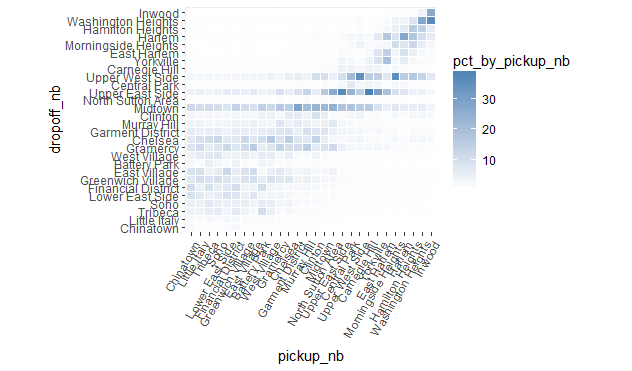

We can take the above numbers and display them in plots that make it easier to digest it all at once.  We begin with a plot showing how taxi trips between any pair of neighborhoods are distributed.

```R
ggplot(rxcs, aes(pickup_nb, dropoff_nb)) + 
  geom_tile(aes(fill = pct_all), colour = "white") + 
  theme(axis.text.x = element_text(angle = 60, hjust = 1)) +
  scale_fill_gradient(low = "white", high = "black") + 
  coord_fixed(ratio = .9)
```


The plot shows that trips to and from the Upper East Side make up the majority of trips, a somewhat unexpected result.  Furthermore, the lion's share of trips are to and from the Upper East Side and the Upper West Side and the midtown neighborhoods (with most of this category having Midtown either as an origin or a destination).  Another surprising fact about the above plot is its near symmetry, which suggests that perhaps most passengers use taxis for a "round trip", meaning that they take a taxi to their destination, and another taxi for the return trip.  This point warrants further inquiry (perhaps by involving the time of day into the analysis) but for now we leave it at that.

Next we look at how trips leaving a particular neighborhood (a point on the x-axis in the plot below), "spill out" into other neighborhoods (shown by the vertical color gradient along the y-axis at each point on the x-axis).

```R
ggplot(rxcs, aes(pickup_nb, dropoff_nb)) + 
  geom_tile(aes(fill = pct_by_pickup_nb), colour = "white") + 
  theme(axis.text.x = element_text(angle = 60, hjust = 1)) +
  scale_fill_gradient(low = "white", high = "steelblue") + 
  coord_fixed(ratio = .9)
```



We can see how most downtown trips are to other downtown neighborhoods or to midtown neighborhoods (especially Midtown).  Midtown and the Upper East Side are common destinations from any neighborhood, and the Upper West Side is a common destination for most uptown neighborhoods.

For a trip ending at a particular neighborhood (represented by a point on the y-axis) we now look at the distribution of where the trip originated from (the horizontal color-gradient along the x-axis for each point on the y-axis).

```R
ggplot(rxcs, aes(pickup_nb, dropoff_nb)) + 
  geom_tile(aes(fill = pct_by_dropoff_nb), colour = "white") + 
  theme(axis.text.x = element_text(angle = 60, hjust = 1)) +
  scale_fill_gradient(low = "white", high = "red") + 
  coord_fixed(ratio = .9)
```


As we can see, a lot of trips claim Midtown regardless of where they ended.  The Upper East Side and Upper West Side are also common origins for trips that drop off in one of the uptown neighborhoods.
