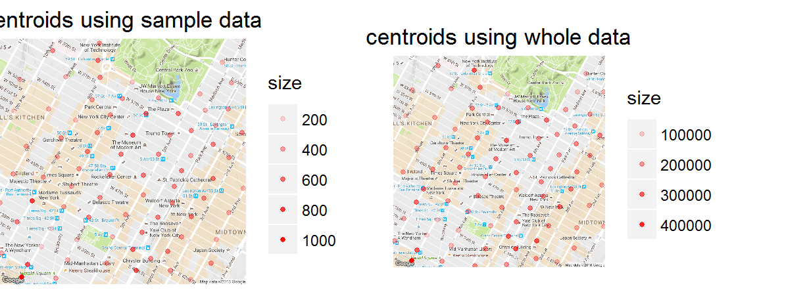

With a little bit of work, we can extract the cluster centroids from the resulting object and plot them on a similar map.  As we can see, the results are not very different, however differences do exist and depending on the use case, such small differences can have a lot of practical significance.  If for example we wanted to find out which spots taxis are more likely to drop off passengers and make it illegal for street vendors to operate at those spots (in order to avoid creating too much traffic), we can do a much better job of narrowing down the spots using the clusters created from the whole data.

```R
centroids_whole <- cbind(
  transmute(as.data.frame(rxkm$centers), long = long_std*(-74), lat = lat_std*40),
  size = rxkm$size, withinss = rxkm$withinss)

q1 <- ggmap(map_15) +
  geom_point(data = centroids_sample, aes(x = long, y = lat, alpha = size),
             na.rm = TRUE, size = 1, col = 'red') +
  theme_nothing(legend = TRUE) +
  labs(title = "centroids using sample data")

q2 <- ggmap(map_15) +
  geom_point(data = centroids_whole, aes(x = long, y = lat, alpha = size),
             na.rm = TRUE, size = 1, col = 'red') +
  theme_nothing(legend = TRUE) +
  labs(title = "centroids using whole data")

require(gridExtra)
grid.arrange(q1, q2, ncol = 2)
```


